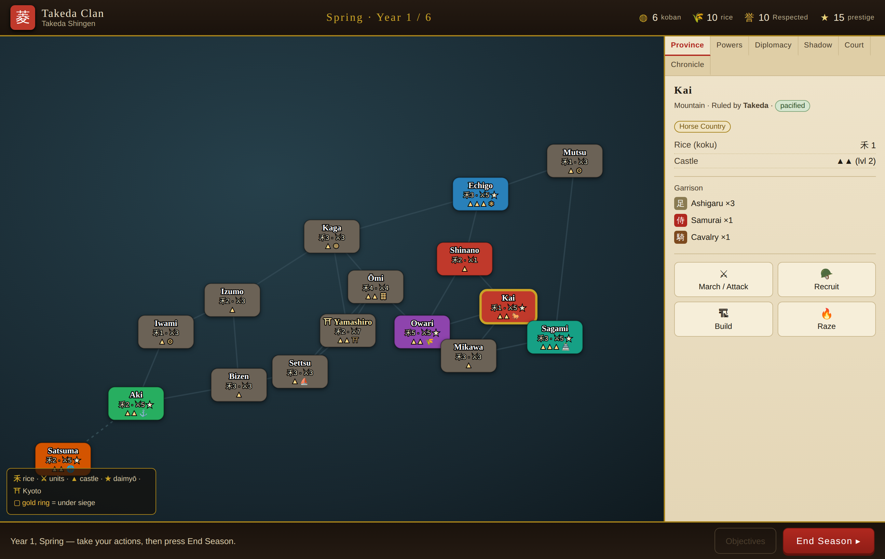

# 将軍 SHŌGUN — Rise of the Clans

A playable digital adaptation of the tabletop grand-strategy game **“Shōgun: Rise of
the Clans” (v1.0)** — war, trade, diplomacy, honour, and intrigue in the struggle to
rule Sengoku-period Japan.

It runs entirely in the browser with **no build step and no dependencies** — just open
a file. You lead one clan (or one retainer of a divided house); the rest are AI.



---

## Play it

**Easiest:** open the single-file build directly in any modern browser:

```
dist/shogun.html
```

**Or run the modular version** (identical game) by serving the folder statically — some
browsers restrict `file://` for multi-file pages, so a tiny server is the safe way:

```bash
# any one of these, from the repo root:
python3 -m http.server 8000
npx http-server -p 8000
# then visit http://localhost:8000/index.html
```

Rebuild the single-file bundle after editing the source:

```bash
node build.js   # writes dist/shogun.html and dist/artifact.html
```

---

## How to win

Everything converts to **Prestige** — the most Prestige at the end of the final year
wins. There are six roads there, and two of them can end the game early:

| Path | Engine |
|------|--------|
| **The Shōgun** (Conquest) | territory + most-territory majority + **sudden win**: hold Kyoto + 55% of Japan |
| **The Merchant Prince** (Wealth) | markets/ports/mines + richest & most-income majorities + **sudden win**: 60 koban & 3+ ports/markets |
| **The Golden Age** (Culture) | temples, shrines, academies + most-culture majority |
| **The Honoured Clan** (Honour) | your end-game Honour band scores −5 → +12, plus the highest-Honour majority |
| **Imperial Legitimacy** (Politics) | climb Court Ranks at Kyoto to Sei-i Taishōgun (the Shōgunate) — gated by Honour |
| **The Shadow** (Intrigue) | banked espionage Prestige + largest-spy-network majority |

## The year

Four seasons turn the clock and the food/weather engine:

- **Spring** — mobilise; snowbound provinces reopen.
- **Summer** — full campaign season; typhoons threaten ships.
- **Autumn** — the **harvest**: you collect the year’s koban and a rice bonus.
- **Winter** — movement halved, **rice upkeep doubled**, guns useless in the cold,
  snowbound provinces (Echigo) sealed. Keep your stores full.

Each season is free-form: recruit, build, march & attack, pacify, run spies, do
diplomacy, and petition the Court — limited only by your resources and one move per
army. Then press **End Season** and the rival clans take their turns.

## War

Select one of your provinces → **March / Attack** → click a neighbour.

- **Declared** attack keeps your Honour; **Surprise** grants an ambush round and blocks
  the enemy from fortifying, but costs 2 Honour.
- The defender **Stands**, **Fortifies** (withdraws into the castle → siege), or **Retreats**.
- On the **Field of Battle**, terrain sets how many units can fight at once (a few hold
  a mountain pass; numbers tell on the plains). Cavalry shock hits on first contact,
  archers and matchlock **Teppō** fire before the melee, and **morale** — not just
  bodies — decides the rout. Pick your formation: **Deep** (resists shock, narrow),
  **Line** (balanced), or **Wide** (more blades, brittle).
- Win the field, batter the **castle** down with a Siege Train (or starve it out), then
  leave a garrison and **pay to Pacify** the province before it revolts.

## Honour

Your name (0–20, five bands from *Infamous* to *Paragon*) is load-bearing: it calms
conquered provinces, gates the Court and binding alliances, decides who will trust you —
and scores heavily at the end. Ruthlessness (surprise attacks, razing, assassination)
wins wars fast, but every point of Honour you spend is Prestige you lose. Winning dirty
is legitimate; it is simply priced.

## The two modes

- **The Warring Clans (Mode A)** — you are a rival daimyō (Takeda, Uesugi, Oda, Hōjō,
  Mōri, or Shimazu) on the national map, versus five AI clans.
- **The House Divided (Mode B)** — you and 4–7 AI retainers all serve **one** clan.
  Hold your fiefs, answer the lord’s directives for **Standing**, survive the outside
  **Threat** of rival clans — and pursue your **secret Ambition**. When the lord dies,
  the **succession crisis** (a negotiated settlement or open civil war) decides
  everything, and every retainer’s hidden goal is revealed.

---

## What’s modelled (and what’s simplified)

Faithfully implemented: the 16-province map with terrain/castles/features, the
season & weather clock, the rice+koban economy with supply lines and attrition, all
seven unit types with their access rules, eight building types, the full
engagement → field-battle → siege → pacification chain, the Honour track and its
effects, the Imperial Court and Shōgunate, espionage (agents, embedding, ops, blowback),
diplomacy (NAP / trade / alliance / marriage / vassalage) with anti-runaway pressure,
Prestige scoring with majorities and sudden wins, and the complete Mode B succession game.

Deliberately streamlined for a single-player video game: it’s human-vs-AI (no
hotseat/online); battles play as an interactive round-by-round summary with the key
choices (posture, surprise vs declared) rather than a fully manual tactical board; and
espionage/diplomacy are functional but lighter than the paper sub-games. Numbers follow
the rulebook with light tuning for balance, as Appendix B invites.

## Project layout

```
index.html          # entry (modular version)
css/style.css       # theme
js/
  data.js           # provinces, clans, units, buildings, events, honour bands, court ranks
  state.js          # new-game setup + shared helpers (access, supply BFS, honour bands)
  engine.js         # season clock, economy, pacification, court, scoring, win/lose
  battle.js         # engagement, field battle, sieges, leader fate, movement, pacify
  espionage.js      # Shinobi, embedding, ops, blowback
  diplomacy.js      # pacts, honour-gated trust, AI acceptance
  ai.js             # AI daimyō (economy, expansion, war, spying, court)
  modeb.js          # The House Divided: fiefs, Standing, threats, Ambitions, succession
  ui.js             # map/panels/modals rendering + interaction
  main.js           # flow controller (season loop)
build.js            # bundles everything into dist/shogun.html
dist/shogun.html    # single-file playable build
```

*A digital adaptation of the fan rulebook “Shōgun: Rise of the Clans, v1.0.” Built for play and study.*
